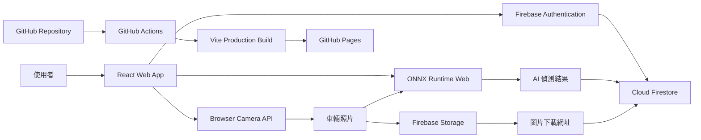
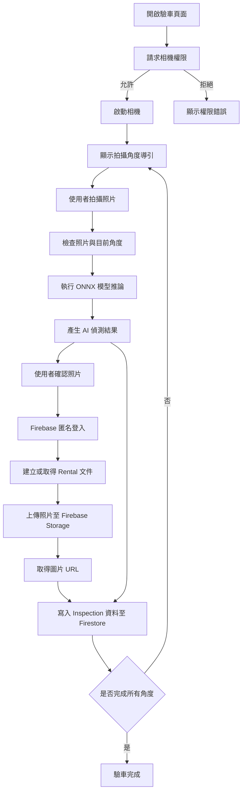
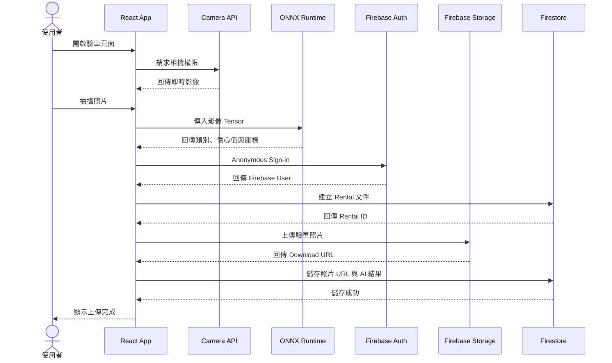

# Smart Car Inspection

## Project Structure

frontend/
React + Vite + TypeScript

ai/
YOLO training
TensorFlow.js export
Jupyter notebooks

docs/
Project documents

# Smart Car Inspection

Smart Car Inspection 是一套以 React、Firebase 與 ONNX Runtime Web 建立的智慧租車驗車系統。

使用者可以透過手機或電腦相機，依照指定角度拍攝車輛照片。系統會在瀏覽器端載入 ONNX 模型進行 AI 推論，並將驗車照片、租借資料與檢測結果上傳至 Firebase。

## 線上 Demo

Production App：

```text
https://selenening99.github.io/smart-car-inspection/app/
```

Engineering / Test Page：

```text
https://selenening99.github.io/smart-car-inspection/
```

## 主要功能

- 車輛角度導引拍攝
- 瀏覽器相機存取
- ONNX 模型載入與推論
- 車輛或損傷偵測
- Firebase Anonymous Authentication
- Firebase Storage 圖片上傳
- Firestore 驗車資料儲存
- GitHub Actions 自動部署
- GitHub Pages 多頁面應用

## 技術架構

| 類別 | 技術 |
|---|---|
| Frontend | React、TypeScript、Vite |
| AI Inference | ONNX Runtime Web |
| Authentication | Firebase Anonymous Authentication |
| Database | Cloud Firestore |
| File Storage | Firebase Storage |
| Hosting | GitHub Pages |
| CI/CD | GitHub Actions |

## 系統架構圖



## 系統流程



## 拍照至 Firebase 的資料流程



## Repository 結構

```text
smart-car-inspection/
├── .github/
│   └── workflows/
│       └── deploy.yml
│
├── ai/
│   └── guide_frames/
│       ├── README.md
│       ├── annotated/
│       │   ├── front_left.jpg
│       │   ├── front_right.jpg
│       │   ├── rear_left.jpg
│       │   ├── rear_right.jpg
│       │   └── _guide_frames_contact_sheet.jpg
│       └── debug/
│
├── frontend/
│   ├── app/
│   │   └── index.html
│   │
│   ├── public/
│   │   └── best.onnx
│   │
│   ├── src/
│   │   ├── features/
│   │   │   └── guided-capture/
│   │   ├── firebase/
│   │   ├── pages/
│   │   └── ...
│   │
│   ├── package.json
│   ├── package-lock.json
│   ├── tsconfig.json
│   └── vite.config.ts
│
└── README.md
```

實際資料夾可能會隨開發調整，請以 repository 目前內容為準。

## Firebase 資料結構

以下為建議的 Firestore 結構。

```text
rentals/
└── {rentalId}
    ├── userId
    ├── vehicleId
    ├── status
    ├── createdAt
    ├── updatedAt
    │
    └── pickupInspections/
        └── {inspectionId}
            ├── angle
            ├── imageUrl
            ├── storagePath
            ├── createdAt
            ├── modelVersion
            └── detections
```

### `rentals/{rentalId}`

```ts
interface Rental {
  userId: string;
  vehicleId?: string;
  status: "draft" | "in_progress" | "completed";
  createdAt: Timestamp;
  updatedAt: Timestamp;
}
```

範例：

```json
{
  "userId": "firebase-anonymous-user-id",
  "vehicleId": "vehicle-001",
  "status": "in_progress",
  "createdAt": "server timestamp",
  "updatedAt": "server timestamp"
}
```

### `pickupInspections/{inspectionId}`

```ts
type CaptureAngle =
  | "front_left"
  | "front_right"
  | "rear_left"
  | "rear_right";

interface Detection {
  label: string;
  confidence: number;
  boundingBox?: {
    x: number;
    y: number;
    width: number;
    height: number;
  };
}

interface PickupInspection {
  angle: CaptureAngle;
  imageUrl: string;
  storagePath: string;
  detections: Detection[];
  modelVersion?: string;
  createdAt: Timestamp;
}
```

範例：

```json
{
  "angle": "front_left",
  "imageUrl": "https://firebasestorage.googleapis.com/...",
  "storagePath": "rentals/rental-id/pickup/front_left.jpg",
  "modelVersion": "best.onnx",
  "detections": [
    {
      "label": "scratch",
      "confidence": 0.91,
      "boundingBox": {
        "x": 120,
        "y": 88,
        "width": 240,
        "height": 130
      }
    }
  ],
  "createdAt": "server timestamp"
}
```

目前程式若使用不同 collection 名稱，例如獨立的 `pickupInspections` collection，請依實際程式調整此段文件。

## Firebase Storage 結構

建議的 Storage 路徑：

```text
rentals/
└── {rentalId}/
    └── pickup/
        ├── front_left.jpg
        ├── front_right.jpg
        ├── rear_left.jpg
        └── rear_right.jpg
```

另一種可避免檔名衝突的格式：

```text
rentals/{rentalId}/pickup/{angle}/{timestamp}.jpg
```

例如：

```text
rentals/abc123/pickup/front_left/1753249200000.jpg
```

## Firebase Security Rules

### Firestore

開發階段可使用登入驗證限制：

```javascript
rules_version = '2';

service cloud.firestore {
  match /databases/{database}/documents {
    match /{document=**} {
      allow read, write: if request.auth != null;
    }
  }
}
```

### Firebase Storage

```javascript
rules_version = '2';

service firebase.storage {
  match /b/{bucket}/o {
    match /{allPaths=**} {
      allow read, write: if request.auth != null;
    }
  }
}
```

以上規則適合目前的開發與展示階段。正式環境應進一步限制使用者只能存取自己建立的租借與驗車資料。

## 環境需求

- Node.js 20 或更新版本
- npm
- Firebase Project
- 支援相機的瀏覽器
- HTTPS 或 localhost 環境

建議瀏覽器：

- Google Chrome
- Safari
- Microsoft Edge

瀏覽器相機 API 通常只能在下列環境使用：

```text
https://...
```

或：

```text
http://localhost
```

## Firebase 環境變數

在 `frontend/` 內建立：

```text
.env.local
```

內容：

```env
VITE_FIREBASE_API_KEY=your_api_key
VITE_FIREBASE_AUTH_DOMAIN=your_project.firebaseapp.com
VITE_FIREBASE_PROJECT_ID=your_project_id
VITE_FIREBASE_STORAGE_BUCKET=your_project.firebasestorage.app
VITE_FIREBASE_MESSAGING_SENDER_ID=your_sender_id
VITE_FIREBASE_APP_ID=your_app_id
```

不要將包含敏感設定的 `.env.local` 提交至 Git。

確認 `.gitignore` 包含：

```gitignore
.env
.env.local
.env.*.local
```

Firebase Web API Key 通常不是伺服器端祕密，但仍應搭配正確的 Authentication、Firestore Rules、Storage Rules 與 App Check。

## 本機執行

### 1. Clone repository

```bash
git clone https://github.com/selenening99/smart-car-inspection.git
cd smart-car-inspection/frontend
```

### 2. 安裝 dependencies

```bash
npm ci
```

若沒有 lock file，才使用：

```bash
npm install
```

### 3. 設定 Firebase

建立：

```text
frontend/.env.local
```

填入 Firebase Web App 設定。

### 4. 啟動開發伺服器

```bash
npm run dev
```

Terminal 會顯示類似：

```text
http://localhost:5173/
```

Production App 可透過：

```text
http://localhost:5173/app/
```

開啟。

### 5. Production build

```bash
npm run build
```

建置結果會輸出至：

```text
frontend/dist/
```

### 6. 本機預覽 production build

```bash
npm run preview
```

## GitHub Pages 部署

本專案使用 GitHub Actions 部署，不使用 `gh-pages` npm 套件。

Workflow 路徑：

```text
.github/workflows/deploy.yml
```

### Workflow 範例

```yaml
name: Deploy GitHub Pages

on:
  push:
    branches:
      - main

permissions:
  contents: read
  pages: write
  id-token: write

concurrency:
  group: pages
  cancel-in-progress: true

jobs:
  build:
    runs-on: ubuntu-latest

    steps:
      - name: Checkout repository
        uses: actions/checkout@v4

      - name: Setup Node.js
        uses: actions/setup-node@v4
        with:
          node-version: 20
          cache: npm
          cache-dependency-path: frontend/package-lock.json

      - name: Install dependencies
        working-directory: frontend
        run: npm ci

      - name: Build
        working-directory: frontend
        run: npm run build

      - name: Configure GitHub Pages
        uses: actions/configure-pages@v5

      - name: Upload Pages artifact
        uses: actions/upload-pages-artifact@v3
        with:
          path: frontend/dist

  deploy:
    environment:
      name: github-pages
      url: ${{ steps.deployment.outputs.page_url }}

    needs: build
    runs-on: ubuntu-latest

    steps:
      - name: Deploy GitHub Pages
        id: deployment
        uses: actions/deploy-pages@v4
```

### GitHub 設定

進入 repository：

```text
Settings → Pages
```

將 Source 設定成：

```text
GitHub Actions
```

### 部署方式

每次 push 到 `main`：

```bash
git add .
git commit -m "Describe the change"
git push origin main
```

GitHub Actions 會自動：

1. 安裝 dependencies
2. 執行 TypeScript 與 Vite build
3. 上傳 `frontend/dist`
4. 部署至 GitHub Pages

可在下列位置查看執行狀態：

```text
GitHub Repository → Actions → Deploy GitHub Pages
```

## Vite GitHub Pages 設定

`frontend/vite.config.ts` 必須包含正確的 repository base path：

```ts
import { defineConfig } from "vite";
import react from "@vitejs/plugin-react";
import { resolve } from "node:path";

export default defineConfig({
  plugins: [react()],

  base: "/smart-car-inspection/",

  build: {
    rollupOptions: {
      input: {
        engineering: resolve(__dirname, "index.html"),
        app: resolve(__dirname, "app/index.html"),
      },
    },
  },
});
```

模型必須放在：

```text
frontend/public/best.onnx
```

Vite build 後應出現在：

```text
frontend/dist/best.onnx
```

前端載入模型時建議使用 Vite base URL：

```ts
const modelUrl = `${import.meta.env.BASE_URL}best.onnx`;
```

不要使用：

```ts
const modelUrl = "/best.onnx";
```

因為 GitHub Pages 專案網站不是部署在網域根目錄，而是：

```text
/smart-car-inspection/
```

## 部署驗證

確認網站：

```bash
curl -I https://selenening99.github.io/smart-car-inspection/app/
```

確認 ONNX 模型：

```bash
curl -I https://selenening99.github.io/smart-car-inspection/best.onnx
```

下載並檢查模型大小：

```bash
curl -L \
  https://selenening99.github.io/smart-car-inspection/best.onnx \
  -o /tmp/best.onnx

ls -lh /tmp/best.onnx
file /tmp/best.onnx
```

預期模型大小約為：

```text
12 MB
```

若下載結果只有數 KB，且 `file` 顯示 HTML，代表 Pages 沒有正確部署模型。

## 常用 Git 指令

確認目前變更：

```bash
git status
```

查看尚未提交的修改：

```bash
git diff
```

提交並推送：

```bash
git add .
git commit -m "Update inspection application"
git push origin main
```

確認本機與 GitHub 是否同步：

```bash
git fetch origin
git status
git branch -vv
```

建立穩定版本：

```bash
git tag v0.1.0
git push origin v0.1.0
```

## 除錯

### 相機無法啟動

確認：

- 使用 HTTPS 或 localhost。
- 已授予瀏覽器相機權限。
- 沒有其他 App 正在占用相機。
- Safari 或 Chrome 的網站設定允許 Camera。

### ONNX 模型載入失敗

確認模型網址：

```text
https://selenening99.github.io/smart-car-inspection/best.onnx
```

並確認程式使用：

```ts
`${import.meta.env.BASE_URL}best.onnx`
```

### Firebase 顯示 permission denied

確認：

- Anonymous Authentication 已啟用。
- 上傳前已成功執行匿名登入。
- Firestore Rules 允許已登入使用者。
- Storage Rules 允許已登入使用者。

### GitHub Actions 部署失敗

檢查：

```text
Repository → Actions → Deploy GitHub Pages
```

常見原因：

- `npm ci` 與 `package-lock.json` 不一致。
- TypeScript build error。
- Firebase 環境變數未提供。
- `frontend/dist` 沒有成功生成。
- GitHub Pages Source 沒有設成 GitHub Actions。

## 後續開發方向

- 即時 Bounding Box 顯示
- 拍照模糊度檢查
- 曝光與亮度檢查
- 車輛角度辨識
- 損傷分類與信心值
- 驗車結果 Review 頁面
- 還車前後照片比對
- 使用者與租車業者帳號系統
- Firebase App Check
- 更嚴格的資料存取規則
- 自動化測試與錯誤監控

## 版本

目前建議版本：

```text
v0.1.0
```

功能範圍：

- 車輛導引拍攝
- ONNX 瀏覽器端推論
- Firebase 驗證
- Firebase 圖片與資料上傳
- GitHub Pages 自動部署

## License

目前尚未指定 License。

在公開 repository 或允許第三方使用之前，建議補上合適的 License，例如 MIT、Apache-2.0 或 Proprietary License。
